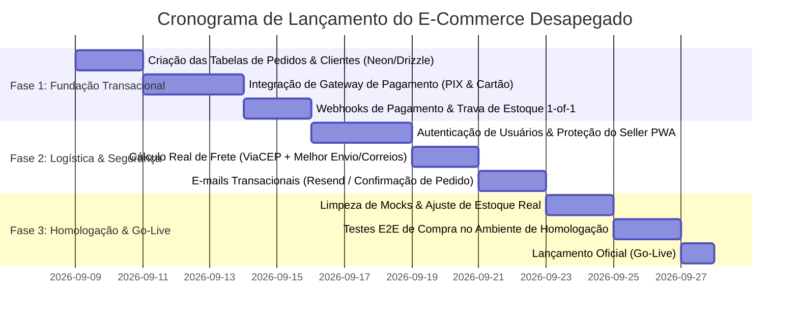

# RELATÓRIO EXECUTIVO & AUDITORIA TÉCNICA // DESAPEGADO
**Status do Projeto & Roadmap para Lançamento do E-Commerce Completo**
**Data:** Setembro / 2026  
**Stack:** Next.js 16 (Turbopack) • React 19 • Tailwind CSS v4 • Drizzle ORM • Neon Serverless PostgreSQL 18 (AWS sa-east-1) • GSAP & ScrollTrigger • Framer Motion • Three.js / React Three Fiber

---

## 1. Visão Geral do Projeto (O Que É o Desapegado)

O **Desapegado** é uma plataforma e-commerce de alto padrão voltada para a curadoria, compra e venda de **streetwear raro, peças de arquivo vintage e passarela**.

Diferente de marketplaces genéricos de segunda mão, o Desapegado opera sob o conceito de **"Monolith Onyx & Basalt"**:
1. **Storefront de Luxo Editorial (`desapegado.com`):** Focado em imersão estética, animações fluidas a 60fps (Lenis Smooth Scroll, GSAP, Three.js), cartões translúcidos com efeito aceternity/spotlight ("Liquid Specular Glass") e tipografia monoespaçada técnica de alta legibilidade.
2. **Seller PWA Utilitário (`/addclothes` e `/admin/produtos`):** Interface mobile-first indestrutível, com contraste preto absoluto, sem efeitos pesados, com botões de toque de no mínimo 48px e captura direta da câmera do smartphone para catalogação instantânea de peças por vendedores e curadores.
3. **Pilar de Confiança & Perícia Forense:** Cada produto possui um "Laudo de Autenticidade Digital" atrelado, especificando densidade têxtil, conformidade de costura, etiquetas holográficas e número de série, resolvendo a maior dor do mercado de streetwear (réplicas/fakes).

---

## 2. O Que Já Temos Desenvolvido & Operando (Módulos Concluídos)

### ✅ Catálogo & Banco de Dados em Produção (Neon PostgreSQL)
* Banco de dados serverless ativo em São Paulo (`sa-east-1`), executando PostgreSQL 18.
* Schema relacional com Drizzle ORM cobrindo:
  - `products`: 16 produtos catalogados (Supreme, Arc'teryx, Bape, Balenciaga, Stüssy, Salomon, etc.).
  - `product_images`: 45 imagens mapeadas com suporte a múltiplas fotos e flags de foto primária.
  - `forensic_reports`: 16 laudos periciais detalhados com notas de inspeção física.
  - `product_measurements`: Dimensões em centímetros (tórax, comprimento, ombro, palmilha, fit).
  - `sellers`: Registro de vendedores verificados.
  - `media_files`: Armazenamento binário/base64 de imagens dentro do banco com streaming dinâmico.

### ✅ Pipeline de Imagens & Otimização
* Endpoint `/api/upload` integrado ao **Sharp**:
  - Conversão inteligente de fotos de iPhone/Android (`HEIC`, `HEIF`, `PNG`, `JPG`) para **WebP** comprimido (qualidade 85).
  - Correção automática de rotação via sensor EXIF do celular (`.rotate()`), evitando fotos de ponta-cabeça.
  - Endpoint de entrega de mídia `/uploads/products/[filename]` com cache imutável de 1 ano (`Cache-Control: public, max-age=31536000, immutable`).

### ✅ Storefront & Home (`/`)
* **Header de Alta Densidade:** Busca centralizada acima do menu de navegação, navegação categorizada (`Novidades`, `Roupas`, `Sneakers`, `Acessórios`, `Marcas`), seletor de moeda (BRL/USD) e contador de sacola.
* **Hero 3D:** Avatar mascote de gorila em Three.js/R3F com iluminação ambiente e parallax via GSAP ScrollTrigger.
* **Kinetic Ticker:** Faixa contínua com mantras da curadoria.
* **Novidades do Acervo:** Grid dinâmico que consome produtos diretamente da API do Neon DB (`/api/products`).
* **Product Card Aceternity:** Efeito spotlight especular que segue a posição do cursor via Framer Motion, cross-fade suave para a segunda foto no hover, selos de condição e compra rápida.
* **Carrossel 3D de Marcas:** Logos em loop rotativo 3D com gaveta expansível para todas as marcas da taxonomia oficial.
* **Smooth Scroll Global:** Lenis integrado sem engasgos.

### ✅ Catálogo / PLP (`/produtos`)
* Barra de filtros horizontal full-width (substituindo a antiga barra lateral vertical):
  - Abas de categorias com contadores dinâmicos de peças em tempo real.
  - Chips de subcategorias contextuais.
  - Filtros suspensos por Marca (23 marcas de arquivo), Condição (`DSWT`, `Excelente`, etc.) e Faixa de Preço.
  - Busca instantânea por palavra-chave.
  - Tags de filtros ativos com remoção unitária e botão de reset global.
  - Ordenação por Destaque, Menor Preço, Maior Preço e A-Z.
  - Drawer dedicado para dispositivos móveis.

### ✅ Página de Produto / PDP (`/produtos/[slug]`)
* Rota dinâmica assíncrona Next.js 16 com `generateStaticParams` e meta tags SEO.
* Galeria com modo zoom óptico e strip de miniaturas.
* Certificado de Perícia Forense visual com itens inspecionados.
* Tabela de medidas reais em centímetros.
* Simulador de frete por CEP.
* Garantias de autenticidade e envio seguro.
* Cross-sell de produtos relacionados da mesma categoria/marca.

### ✅ Sacola de Compras (`/carrinho`)
* Estado reativo global persistido em `localStorage` via Zustand (`useCartStore`).
* Lista de itens com fotos, marcas, tamanhos, ajuste de quantidade e exclusão.
* Cálculo em tempo real de subtotal, frete e cupons de desconto (`ONYX10`, `VIP15`).
* Estado vazio amigável e atalhos rápidos.

### ✅ Checkout Multietapas (`/checkout`)
* Wizard em 5 passos com validações de UI:
  1. Identificação (Nome, E-mail, CPF, Celular).
  2. Endereço (CEP, Rua, Número, Bairro, Cidade, Estado).
  3. Frete (PAC, Sedex, White Glove Concierge).
  4. Pagamento (PIX com 5% OFF, Cartão de Crédito em até 12x, Crypto).
  5. Confirmação com geração de número de pedido e chave PIX para cópia.

### ✅ Seller PWA (`/addclothes` e `/admin/produtos`)
* Formulário mobile completo para vendedores e curadores.
* Disparo de câmera nativa e upload múltiplo de galeria.
* Seletores em cascata para toda a taxonomia oficial do projeto.
* Server Action (`createProductAction`) que cadastra o produto, imagens, laudo forense e medidas diretamente no Neon DB e invalida o cache do Next.js.

---

## 3. O Que Falta Corrigir e Implementar para Lançar o E-Commerce Completo

Abaixo está o diagnóstico das lacunas reais existentes entre o protótipo/frontend atual e um e-commerce operacional em produção:

### 🔴 1. Gateway de Pagamento Real & Webhooks (Imprescindível - P0)
* **Estado Atual:** A tela de checkout é uma simulação de frontend. Ao clicar em "Confirmar Aquisição", um ID aleatório (`MNL-2026-XXXX`) é gerado no client-side e uma string PIX estática é exibida. Nenhum dinheiro é transacionado.
* **O que precisa ser feito:**
  - Integrar um provedor de pagamento nacional robusto (ex: **Mercado Pago**, **Asaas**, **Pagar.me** ou **Stripe Brasil**).
  - **PIX Dinâmico:** Gerar QR Code e payload copia-e-cola com expiração de 15 minutos diretamente pela API do gateway.
  - **Cartão de Crédito:** Implementar tokenização de cartão PCI-DSS compatível (campos seguros/iframes para não trafegar dados sensíveis no servidor), suporte a parcelamento com juros/sem juros e envio para antifraude (ClearSale/Konduto).
  - **Endpoint de Webhook (`/api/webhooks/payment`):** Ouvir os eventos do gateway (`payment.created`, `payment.approved`, `payment.failed`, `chargeback`) com validação de assinatura criptográfica HMAC e atualizar o status do pedido no banco de dados.

### 🔴 2. Persistência de Pedidos no Banco de Dados (Imprescindível - P0)
* **Estado Atual:** No banco de dados (`src/db/schema.ts`), **NÃO EXISTEM** tabelas de pedidos, clientes ou transações financeiras. Quando o cliente fecha a compra, nenhum registro é gravado no Neon DB.
* **O que precisa ser feito:**
  - Criar as tabelas no Drizzle:
    - `orders`: `id`, `order_number`, `customer_id`, `subtotal`, `discount_amount`, `shipping_amount`, `total_amount`, `payment_method`, `payment_status` (`PENDING`, `PAID`, `CANCELLED`, `REFUNDED`), `shipping_status` (`PREPARING`, `SHIPPED`, `DELIVERED`), `shipping_tracking_code`, `shipping_address_json`, `created_at`, `updated_at`.
    - `order_items`: `id`, `order_id`, `product_id`, `size`, `price_at_purchase`, `quantity`.
    - `customers`: `id`, `name`, `email`, `cpf`, `phone`, `created_at`.
    - `payments`: `id`, `order_id`, `gateway_tx_id`, `method`, `status`, `pix_qr_code_url`, `pix_payload`, `paid_at`.
  - Criar Server Action ou API Route (`/api/orders/create`) para criar o pedido de forma transacional (`run_sql_transaction` / Drizzle transaction).

### 🔴 3. Controle de Concorrência & Estoque Único (Imprescindível - P0)
* **Regra de Negócio de Streetwear de Arquivo:** Quase todas as peças são únicas (1 de 1).
* **Estado Atual:**
  - A sacola permite adicionar múltiplas unidades do mesmo item (`quantity + 1`).
  - Não há trava atômica no banco durante o checkout; se dois clientes tentarem pagar a mesma peça ao mesmo tempo, ambos conseguiriam.
* **O que precisa ser feito:**
  - Na sacola (`useCartStore`), limitar `maxQuantity = 1` para produtos classificados como peça única.
  - Ao iniciar o checkout/gerar PIX, reservar temporariamente o produto (ex: status `RESERVED` por 15 minutos).
  - Ao confirmar o pagamento via webhook, atualizar `products.status = 'SOLD'`.
  - Nas telas de vitrine e PDP, desabilitar a compra e exibir badge visual `ESGOTADO // ARQUIVADO` para peças vendidas.

### 🟡 4. Autenticação Real & Proteção de Rotas Administrativas (Prioridade Alta - P1)
* **Estado Atual:**
  - A tela `/entrar` é um formulário estático que apenas simula login com um `setTimeout(..., 1200)`.
  - As rotas `/addclothes` e `/admin/produtos` estão **completamente abertas**. Qualquer usuário que digitar a URL pode cadastrar peças e fazer upload de arquivos direto no banco Neon de produção.
* **O que precisa ser feito:**
  - Implementar autenticação real (ex: **Auth.js / NextAuth**, **Clerk** ou **Neon Auth** com cookies de sessão HTTP-Only).
  - Criar Middleware Next.js protegendo as rotas `/admin/*` e `/addclothes`, exigindo papel/role `SELLER` ou `ADMIN`.
  - Criar área do cliente (`/minha-conta` ou `/perfil`):
    - Visualizar histórico de pedidos e status de entrega.
    - Download do Laudo de Autenticidade em PDF.
    - Endereços salvos para recompra em 1 clique.

### 🟡 5. Cálculo Real de Frete & Integração com Correios/Transportadora (Prioridade Alta - P1)
* **Estado Atual:** Valores de frete são fixos e simulados (PAC R$ 24,90, Sedex R$ 46,50, Concierge R$ 120,00).
* **O que precisa ser feito:**
  - Integrar API de cotação de fretes (ex: **Melhor Envio**, **Frenet**, **Kangu** ou API oficial dos **Correios**) calculando prazo e preço reais a partir do CEP de origem (São Paulo), CEP do destinatário, peso (`weightKg`) e cubagem da embalagem.
  - Integração com a API do **ViaCEP** no checkout: ao digitar os 8 dígitos do CEP, preencher automaticamente Rua, Bairro, Cidade e Estado, reduzindo o atrito de checkout em 60%.
  - Geração automática de etiqueta de postagem e código de rastreio para envio ao cliente.

### 🟡 6. Disparo de E-mails Transacionais & Notificações (Prioridade Alta - P1)
* **Estado Atual:** Não há serviço de envio de e-mails configurado.
* **O que precisa ser feito:**
  - Configurar serviço transacional (**Resend**, **Postmark** ou **SendGrid**).
  - Templates em HTML editorial escuro para:
    1. *Pedido Realizado:* com instrução do Pix copia-e-cola e código de barras.
    2. *Pagamento Aprovado:* com nota fiscal e laudo pericial anexado.
    3. *Pedido Postado:* com link direto de rastreamento dos Correios.
    4. *Pedido Entregue.*
  - (Opcional) Notificações instantâneas via WhatsApp da confirmação do Pix e código de rastreio.

### 🟢 7. Armazenamento de Mídia em Nuvem (Object Storage) para Escala (Prioridade Média - P2)
* **Estado Atual:** As imagens são processadas pelo Sharp e salvas em Base64 no banco Neon PostgreSQL (`media_files`). Essa solução foi engenhosa para contornar o sistema de arquivos somente-leitura de ambientes serverless/Netlify sem custos adicionais imediatos.
* **O que precisa ser feito para escala comercial:**
  - Armazenar dezenas de megabytes de imagens em Base64 no banco de dados encarece o tráfego e o armazenamento do Postgres conforme o catálogo cresce para centenas de itens.
  - Conectar o storage adapter a um bucket S3 compatível de alta velocidade e baixo custo (ex: **Cloudflare R2** com saída gratuita de dados ou **AWS S3**), servido sob CDN próprio (ex: `cdn.desapegado.com`).

### 🟢 8. Limpeza de Mocks & Conformidade Legal Brasileira (Prioridade Média - P2)
* **Sacola Inicial:** No arquivo `src/features/storefront/stores/useCartStore.ts`, o carrinho inicializa com 2 produtos mockados para testes (`prod-1` e `prod-5`). Deve inicializar vazio (`items: []`).
* **Fotos do Catálogo Inicial:** Os produtos de semente (`src/features/storefront/data/products.ts`) utilizam imagens de placeholder do Unsplash/Picsum. Devem ser substituídos pelas fotos reais dos itens físicos em estoque.
* **Conformidade Legal do E-commerce (Decreto Federal nº 7.962/2013):**
  - Adicionar no rodapé (`Footer.tsx`): Razão Social, CNPJ da empresa, endereço físico da sede, canais oficiais de atendimento ao consumidor (SAC, e-mail de suporte e horário de funcionamento).
  - Páginas de Termos de Serviço, Política de Trocas e Devoluções (Direito de arrependimento de 7 dias do CDC) e Política de Privacidade (LGPD).

---

## 4. Plano de Ação & Cronograma Sugerido para o Lançamento

---

## 5. Resumo Conclusivo

O projeto **Desapegado** já possui um nível de excelência visual, arquitetura de software e experiência do usuário (UX/UI) muito superior ao mercado comum. O design system *Monolith Onyx Basalt*, o catálogo dinâmico, as animações e a esteira de processamento de fotos já estão plenamente operacionais.

Para transformar esta obra de arte visual em uma máquina de vendas em produção, o foco agora é estritamente de **infraestrutura transacional**:
1. Salvar os pedidos no banco Neon;
2. Conectar um processador de pagamentos real com webhook;
3. Amarrar o estoque único para bloquear peças vendidas;
4. Proteger o painel de upload com senha/login.

Assim que essas 4 etapas forem concluídas, o e-commerce estará 100% apto para processar vendas reais com total segurança.
